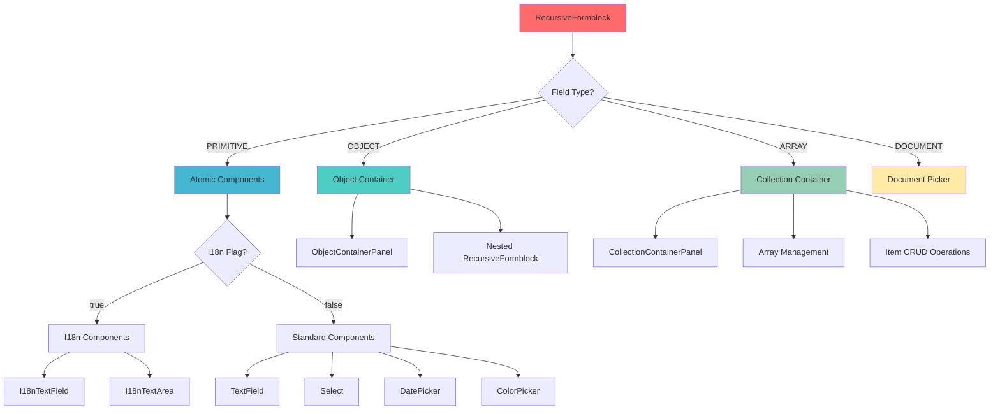
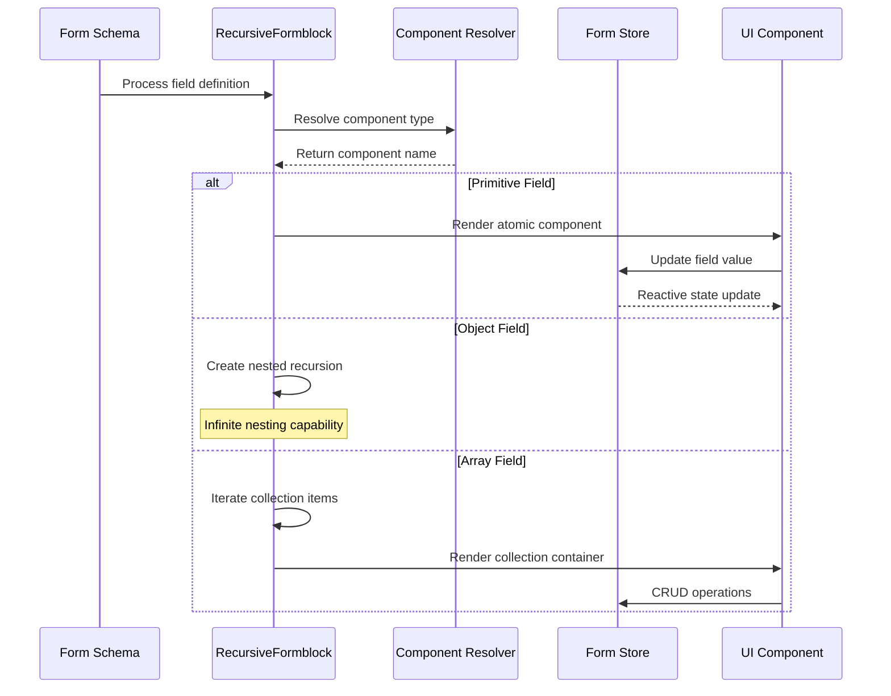
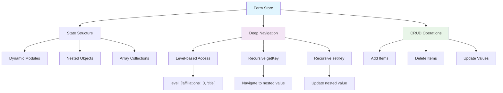
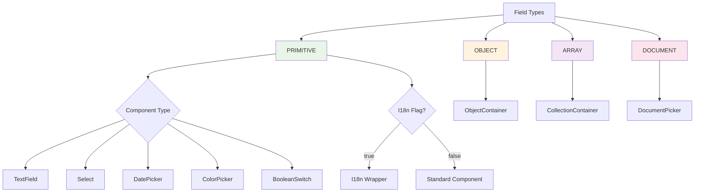
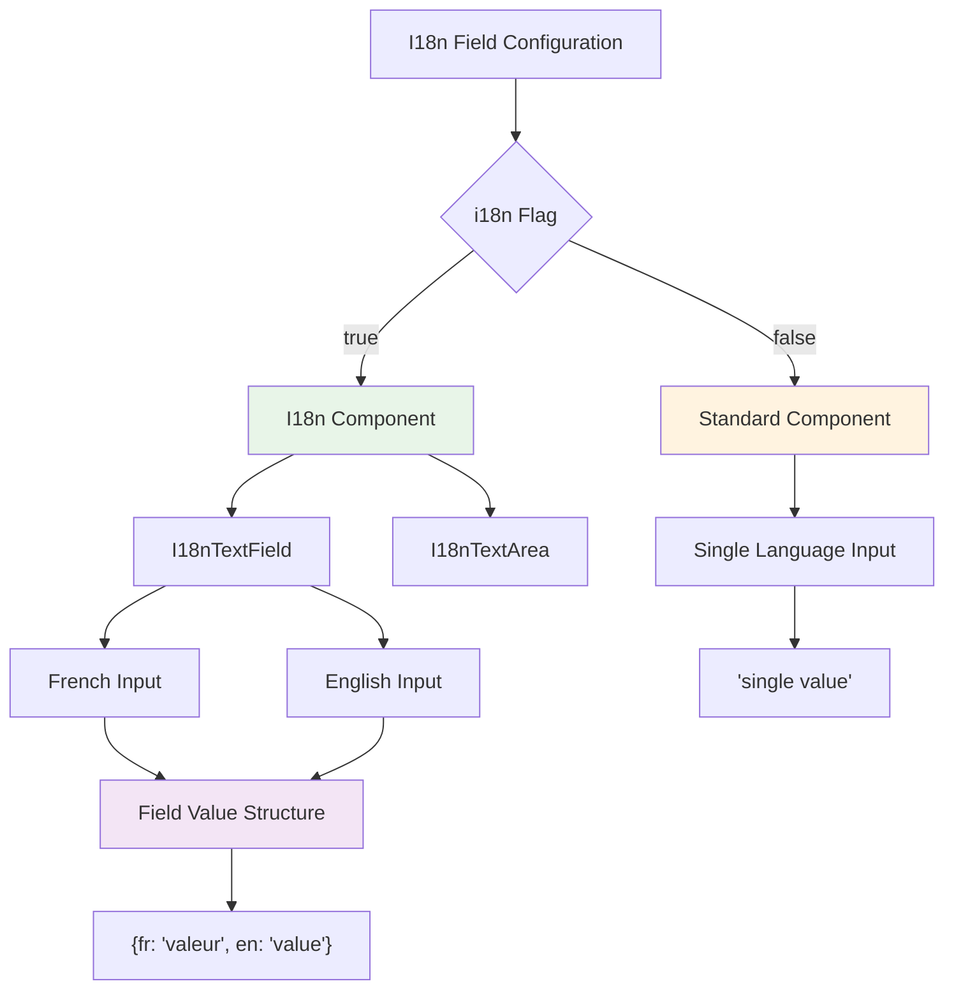
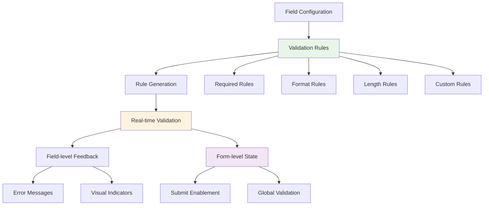
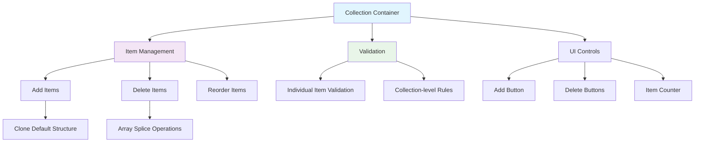

# @paris-ias/form - Canopy Form Module

The `@paris-ias/form` module is a sophisticated Nuxt 3 module that generates dynamic, recursive forms from data models defined in `@paris-ias/data`. It implements the **local atomic rules, global behavior** and **data-driven declarative UI** principles of the Canopy architecture, providing a complete form generation system with deep nesting, validation, and internationalization.

## 🏗️ Architecture Overview

The form module transforms form trees from the types module into fully functional, recursive forms with validation, state management, and complex nested structures.

```mermaid
graph TD
    A[@paris-ias/data Form Trees] --> B[RecursiveFormblock Engine]
    B --> C[Component Resolution]
    B --> D[State Management]  
    B --> E[Validation System]
    
    C --> F[Atomic Components]
    C --> G[Molecular Containers]
    C --> H[I18n Components]
    
    D --> I[Pinia Form Store]
    D --> J[Deep Nesting Support]
    D --> K[Reactive Updates]
    
    E --> L[Field Validation]
    E --> M[Form Validation]
    E --> N[Error Handling]
    
    F --> O[TextField]
    F --> P[Select]
    F --> Q[DatePicker]
    F --> R[FileInput]
    
    G --> S[CollectionContainer]
    G --> T[ObjectContainer]
    G --> U[DocumentPicker]
    
    style A fill:#e1f5fe
    style B fill:#f3e5f5
    style C fill:#e8f5e8
    style D fill:#fff3e0
    style E fill:#fce4ec
```

## 🧩 Component Architecture

The form module follows a recursive, atomic design pattern optimized for infinite nesting:



## 📂 Key Files and Components

### Core Module Files

| File | Purpose | Key Features |
|------|---------|--------------|
| [`src/module.ts`](/home/bob/Projects/Apex/frontend/modules/form/src/module.ts) | Nuxt module definition | Component registration, plugin setup, i18n integration |
| [`src/runtime/stores/form.ts`](/home/bob/Projects/Apex/frontend/modules/form/src/runtime/stores/form.ts) | Form state management | Deep nested operations, reactive updates |
| [`src/runtime/components/form/organisms/RecursiveFormblock.vue`](/home/bob/Projects/Apex/frontend/modules/form/src/runtime/components/form/organisms/RecursiveFormblock.vue) | Main form recursion engine | Handles all form types, infinite nesting |
| [`src/runtime/composables/useFormDisplay.ts`](/home/bob/Projects/Apex/frontend/modules/form/src/runtime/composables/useFormDisplay.ts) | Component resolution logic | Dynamic component mapping |

### Atomic Components (Field Types)

| Component | Purpose | Features |
|-----------|---------|----------|
| [`TextField.vue`](/home/bob/Projects/Apex/frontend/modules/form/src/runtime/components/form/atoms/TextField.vue) | Text input with validation | Rules, required indicators, reactive binding |
| [`I18nTextField.vue`](/home/bob/Projects/Apex/frontend/modules/form/src/runtime/components/form/atoms/I18nTextField.vue) | Internationalized text input | Side-by-side EN/FR inputs |
| [`Select.vue`](/home/bob/Projects/Apex/frontend/modules/form/src/runtime/components/form/atoms/Select.vue) | Dropdown selection | Single/multi-select, options from data |
| [`DatePicker.vue`](/home/bob/Projects/Apex/frontend/modules/form/src/runtime/components/form/atoms/DatePicker.vue) | Date selection | Calendar picker with validation |
| [`ColorPicker.vue`](/home/bob/Projects/Apex/frontend/modules/form/src/runtime/components/form/atoms/ColorPicker.vue) | Color selection | Visual color picker |
| [`FileInput.vue`](/home/bob/Projects/Apex/frontend/modules/form/src/runtime/components/form/atoms/FileInput.vue) | File upload | Progress, validation, preview |
| [`BooleanSwitch.vue`](/home/bob/Projects/Apex/frontend/modules/form/src/runtime/components/form/atoms/BooleanSwitch.vue) | Toggle switch | Boolean values with styling |

### Molecular Components (Containers)

| Component | Purpose | Features |
|-----------|---------|----------|
| [`CollectionContainerPanel.vue`](/home/bob/Projects/Apex/frontend/modules/form/src/runtime/components/form/molecules/CollectionContainerPanel.vue) | Array field wrapper | Add/remove items, iteration management |
| [`ObjectContainerPanel.vue`](/home/bob/Projects/Apex/frontend/modules/form/src/runtime/components/form/molecules/ObjectContainerPanel.vue) | Object field wrapper | Visual container for nested objects |
| [`DocumentPicker.vue`](/home/bob/Projects/Apex/frontend/modules/form/src/runtime/components/form/molecules/DocumentPicker.vue) | Document selection | Reference existing database documents |
| [`ImagePicker.vue`](/home/bob/Projects/Apex/frontend/modules/form/src/runtime/components/form/molecules/ImagePicker.vue) | Image selection | Image browsing and selection |

## 🔄 Recursive Form Generation

The core innovation is the recursive form generation system that handles infinite nesting:



### Type-Based Component Resolution

The system automatically resolves components based on field type and configuration:

```typescript
// Component resolution with i18n support
const getComponentName = (name: string, i18n = false) => {
  const componentMap = {
    TextField: i18n ? "FormAtomsI18nTextField" : "FormAtomsTextField",
    TextArea: i18n ? "FormAtomsI18nTextArea" : "FormAtomsTextArea",
    Select: "FormAtomsSelect",
    DatePicker: "FormAtomsDatePicker",
    ColorPicker: "FormAtomsColorPicker",
    CollectionContainerPanel: "FormMoleculesCollectionContainerPanel",
    ObjectContainerPanel: "FormMoleculesObjectContainerPanel"
  };
  return componentMap[name] || "FormAtomsTextField";
};
```

## 🗄️ Advanced State Management

The form module implements a sophisticated nested state management system:



### Deep State Navigation

```typescript
// Recursive getter for nested values
getKey({ level, store }): any {
  if (level.length === 1) {
    const currentKey = level[0];
    const isArrayIndex = typeof currentKey === "number";
    return isArrayIndex ? store.at(currentKey) : store[currentKey];
  }
  
  return this.getKey({
    level: level.slice(1),
    store: store[level[0]]
  });
}

// Recursive setter for nested updates
setKey({ value, category, level, store }): any {
  if (level.length === 1) {
    store[level[0]] = value;
    return;
  }
  
  const isArrayIndex = typeof level[0] === "number";
  if (store[level[0]] === undefined) {
    store[level[0]] = isArrayIndex ? [] : {};
  }
  
  return this.setKey({
    value,
    level: level.slice(1), 
    category,
    store: store[level[0]]
  });
}
```

## 🎯 Field Type System

The form module supports all Canopy field types with automatic component resolution:



### Component Resolution Logic

```typescript
// From RecursiveFormblock.vue
<template>
  <div class="recursive-form-block">
    <!-- PRIMITIVE -->
    <template v-if="input.type === 'PRIMITIVE'">
      <component
        :is="getComponentName(input.component, input.i18n)"
        v-if="computeConditional(input)"
        :args="{ ...input, key: level[level.length - 1] }"
        :level
        :category
      />
    </template>
    
    <!-- ARRAY -->
    <template v-else-if="input.type === 'ARRAY'">
      <component
        :is="getComponentName(input.component)"
        :args="{ ...input }"
        :level
        :category
      />
    </template>
  </div>
</template>
```

## 🌐 Internationalization System

The form module provides comprehensive i18n support with dual-language interfaces:



### I18n Component Implementation

```vue
<!-- I18nTextField.vue -->
<template>
  <v-row no-gutters>
    <v-col cols="6">
      <div class="text-overline">{{ $t("french-version") }}</div>
      <FormAtomsTextField
        :args
        :level="[...level, 'fr']"
        :category
        class="mr-2"
      />
    </v-col>
    <v-col cols="6">
      <div class="text-overline">{{ $t("english-version") }}</div>
      <FormAtomsTextField :args :level="[...level, 'en']" :category />
    </v-col>
  </v-row>
</template>
```

## 🔧 Validation System

The module implements comprehensive field and form validation:



### Validation Implementation

```typescript
// From TextField.vue
<v-text-field
  v-model="val"
  :rules="generateInputRules(args)"
  :required="(args.rules && args.rules.required) || false"
>
  <template #label>
    <span>{{ $t(args.label) }}</span>
    <sup>
      <v-icon
        v-if="args.rules && args.rules.required"
        color="red"
        size="small"
      >
        mdi-asterisk
      </v-icon>
    </sup>
  </template>
</v-text-field>
```

## 🏗️ Collection Management

The form module provides sophisticated array/collection handling:



### Collection Container Features

```vue
<!-- CollectionContainerPanel.vue -->
<template>
  <v-card class="mb-3 pa-3">
    <FormAtomsBlockTitle
      :label="$t(args.label, 2)"
      :add-btn="true"
      :disabled="!valid"
      @add="addItem"
    />
    
    <!-- Iterate through collection items -->
    <template v-for="(item, index) in val" :key="index">
      <v-divider class="my-2" />
      
      <!-- Item header with delete button -->
      <div class="text-overline d-flex align-center justify-space-between">
        {{ $t(args.label, 1) + " " + (index + 1) }}
        <v-btn
          icon="mdi-delete"
          variant="outlined"
          @click="deleteItem(index)"
        />
      </div>
      
      <!-- Recursive form fields for each item -->
      <template v-for="(key, keyIndex) in Object.keys(args.items)">
        <component
          :is="getComponentName(args.items[key].component, args.items[key].i18n)"
          :args="{ ...args.items[key] }"
          :level="[...level, index, key]"
          :category
        />
      </template>
    </template>
  </v-card>
</template>
```

## 🎨 Advanced Component Features

### Document Picker Integration

```typescript
// DocumentPicker for referencing existing database documents
const documentTypes = {
  'people': 'FormAtomsPickerPeopleItem',
  'events': 'FormAtomsPickerEventsItem',
  'publications': 'FormAtomsPickerPublicationsItem'
};

// Automatic component resolution for different document types
const getPickerItemComponentName = (category: string) => {
  const capitalizedCategory = category.charAt(0).toUpperCase() + category.slice(1);
  return `FormAtomsPicker${capitalizedCategory}Item`;
};
```

### File Upload System

- **Multiple File Types**: Images, documents, videos
- **Progress Indicators**: Upload progress with visual feedback  
- **Validation**: File type, size, format validation
- **Preview**: Image and document previews
- **Error Handling**: Graceful error recovery

## 🚀 Usage Patterns

### 1. Basic Form Creation

```vue
<template>
  <FormOrganismsForm category="people" />
</template>

<script setup>
// Automatic form generation from people data model
// Form state automatically managed in Pinia store
</script>
```

### 2. Custom Recursive Form Block

```vue
<template>
  <FormOrganismsRecursiveFormblock
    :input="fieldDefinition"
    :category="'events'"
    :level="['title']"
    :saving="false"
  />
</template>

<script setup>
const fieldDefinition = {
  type: 'PRIMITIVE',
  component: 'TextField',
  label: 'Event Title',
  i18n: true,
  rules: { required: true }
};
</script>
```

### 3. Programmatic Form Access

```typescript
const formStore = useFormStore();

// Get nested field value
const affiliationTitle = formStore.getKey({
  level: ['affiliations', 0, 'organization', 'name'],
  store: formStore.people
});

// Update nested field
formStore.setKey({
  value: 'New Organization',
  level: ['affiliations', 0, 'organization', 'name'],
  category: 'people',
  store: formStore.people
});

// Add new collection item
formStore.addFormItem({
  category: 'people',
  level: ['affiliations']
});
```

## 🎛️ Module Configuration

### Nuxt Module Setup

```typescript
// nuxt.config.ts
export default defineNuxtConfig({
  modules: ['@paris-ias/form'],
  form: {
    modules: ['people', 'events', 'publications'],
    enableGraphQL: true,
    componentPrefix: 'Form'
  }
});
```

### Runtime Configuration Options

- **GraphQL Integration**: Mutation support for form submissions
- **Validation Rules**: Custom validation rule registration
- **Component Themes**: Vuetify theme integration
- **Translation Support**: Multi-language form labels

## 🤝 Integration with Canopy Ecosystem

The form module seamlessly integrates with other Canopy components:

- **[@paris-ias/data](../types)**: Consumes form trees and validation configurations
- **[@paris-ias/list](../list)**: Shares state management patterns and component structure
- **[Seed Project](../seed)**: Provides content creation and editing forms
- **[Apex Project](../Apex)**: Powers administrative and user-facing forms

## 🔍 Error Handling and Validation

The module implements multi-layer error handling:

- **Field-level Validation**: Real-time validation with user feedback
- **Form-level Validation**: Global form state validation
- **Network Error Handling**: Graceful API failure handling
- **State Recovery**: Automatic recovery from corrupted states
- **User Feedback**: Clear error messages and visual indicators

## 📈 Performance Optimizations

- **Component Lazy Loading**: Fields loaded only when visible
- **Reactive Updates**: Minimal re-renders using Vue 3 reactivity
- **Memory Management**: Automatic cleanup of nested components
- **Validation Debouncing**: Optimized validation timing
- **State Normalization**: Efficient nested state updates

## 🎨 Styling and Theming

The form module integrates seamlessly with Vuetify and supports:

- **Theme Consistency**: Respects application theme settings
- **Responsive Design**: Mobile-first responsive components
- **Accessibility**: Full WCAG compliance with proper ARIA labels
- **Customization**: Override default styling per field type
- **Material Design**: Consistent Material Design patterns

This comprehensive form system enables the creation of complex, nested forms with minimal configuration while maintaining full type safety, validation, and internationalization throughout the recursive component tree.